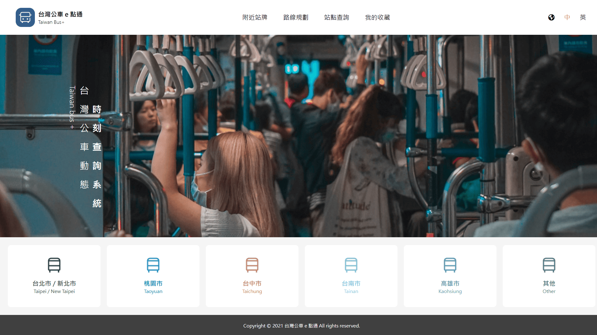

# boostrap_tailwindcss_rwd
Bootstrap/Tailwind/RWD作品集

# 🎨 RWD 切版作品集（含自設計版型 & 他人提供設計版形）

這份作品集展示了我使用 HTML/CSS、Bootstrap 5 與 Tailwind CSS和少量ES6 JS畫面切換功能，從設計到切版獨立完成的 RWD 響應式網頁範例。

---

### 🔹 作品一：全台公車動態時刻查詢應用服務（Tailwind CSS）
設計師：[鹽酥G](https://2021.thef2e.com/users/6296432819610583727/)  
稿件：[FIGMA](https://www.figma.com/design/JTb1ArUXnSceYEt6DmCGib/Week3---%E5%85%A8%E5%8F%B0%E5%85%AC%E8%BB%8A%E5%8B%95%E6%85%8B%E6%99%82%E5%88%BB%E6%9F%A5%E8%A9%A2%E6%87%89%E7%94%A8%E6%9C%8D%E5%8B%99?node-id=52-3060&t=e1g8eYJHBKF8NfTh-1)  

 

 🔧 使用技術：HTML5 + Tailwind CSS + ES6
- 📱 響應式支援手機 / 平板 / 桌機
- 💡 特色元件：導覽列、卡片區塊、行動導向按鈕
